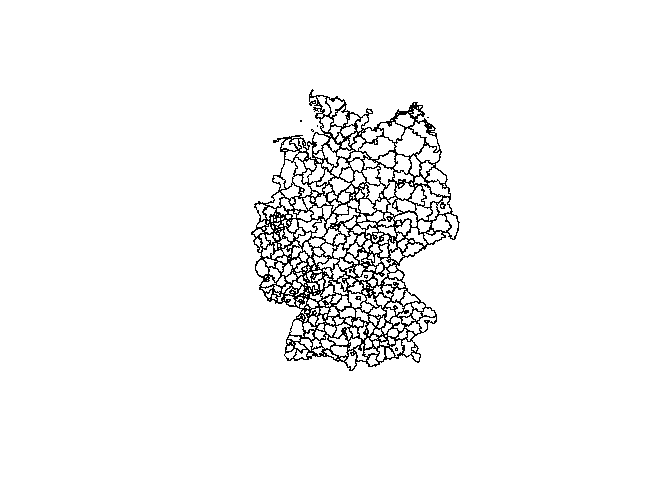
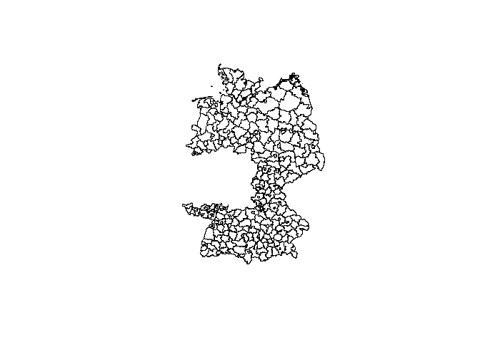

<!-- README.md is generated from README.Rmd. Please edit that file -->

# ffm

<!-- badges: start -->
<!-- badges: end -->

`{ffm}` is an R package that provides quick and easy access to data from
the geodata center of Germany’s Federal Agency for Cartography and
Geodesy (BKG). The BKG is the official provider of spatial data in
Germany and provides quite a few datasets as open data. These data range
from administrative areas to earth observation data and are often
crucial when working with regional statistics from Germany. Part of the
motivation for this package stems from frustration when working areal
identifiers returned by packages like `{wiesbaden}` or `{restatis}` and
not being able to quickly link them to their spatial representations.

The name `ffm` is based on the colloquial short name of Frankfurt am
Main where the BKG’s headquarters are located.

## Installation

You can install the development version of ffm from
[GitHub](https://github.com/) with:

``` r
# install.packages("pak")
pak::pak("jslth/ffm")
```

## Example

Retrieving data is pretty straightforward:

``` r
library(ffm)
districts <- bkg_admin(level = "krs")
plot(districts$geometry)
```



The package makes it easy to go deeper than just getting the data. In
many functions, you can use spatial filters.

``` r
districts <- bkg_admin(
  level = "krs",
  bbox = c(xmin = 300000, ymin = 5500000, xmax = 600000, ymax = 5700000),
  predicate = "disjoint"
)
plot(districts$geometry)
```



Attribute filters are supported using a R-like syntax.

<details>
<summary>
Code for the plot
</summary>

``` r
library(ggplot2)

munics$popdens <- munics$ewz / munics$kfl
munics$popdens[munics$popdens == 0] <- NA
ggplot(munics) +
  geom_sf(aes(fill = popdens), color = NA) +
  scale_fill_viridis_b("Population / km²", transform = "log10") +
  ggtitle("Population density in Southern Germany") +
  theme_void()
```

</details>


