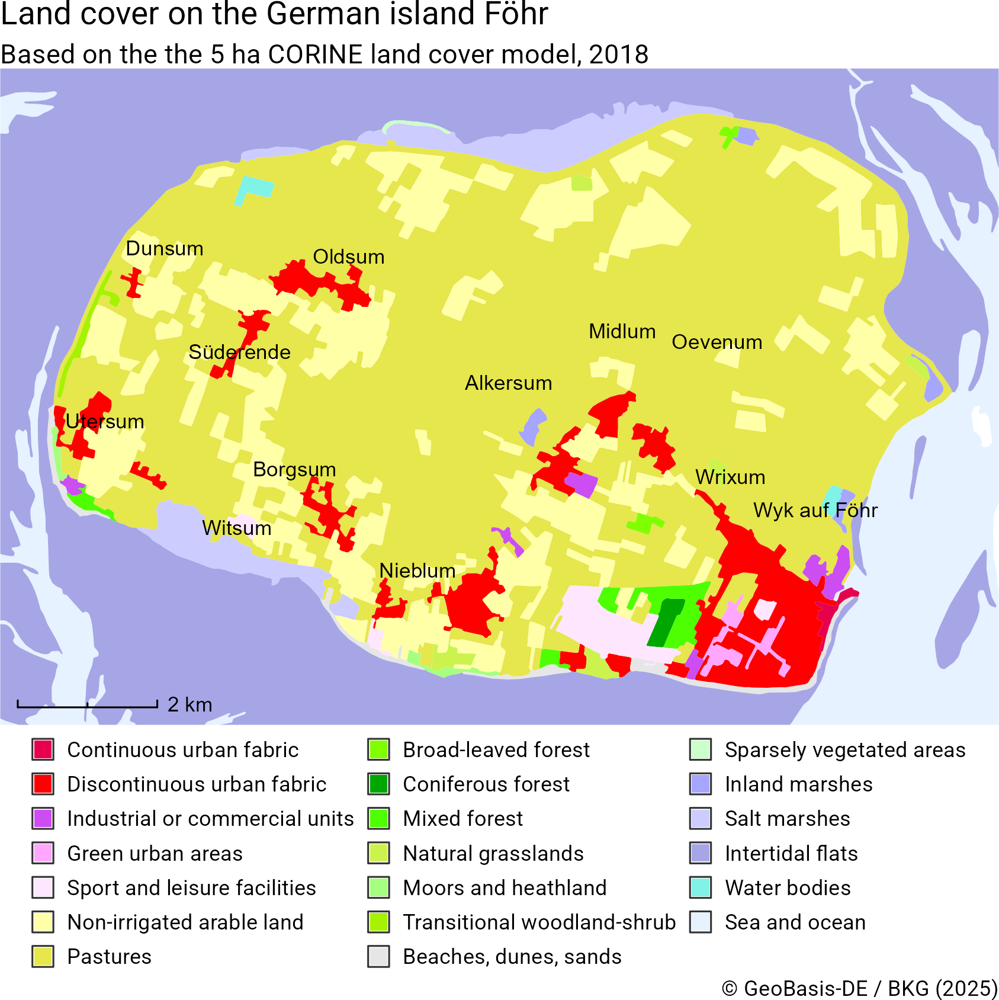

<!-- README.md is generated from README.Rmd. Please edit that file -->

# ffm 

<!-- badges: start -->

[](https://github.com/jslth/ffm/actions/workflows/R-CMD-check.yaml)
[](https://app.codecov.io/gh/jslth/ffm)
[](https://CRAN.R-project.org/package=ffm)
[](https://www.repostatus.org/#active)
[](https://CRAN.R-project.org/package=ffm)
[](https://www.codefactor.io/repository/github/jslth/ffm/overview/main)
<!-- badges: end -->

`{ffm}` is an R package that provides quick and easy access to data from
the geodata center of Germany’s Federal Agency for Cartography and
Geodesy (BKG). The BKG is the official provider of spatial data in
Germany and provides quite a few datasets as open data. These data range
from administrative areas to earth observation data and are often
crucial when working with regional statistics from Germany. Part of the
motivation for this package stems from frustration when working areal
identifiers returned by packages like `{wiesbaden}` or `{restatis}` and
not being able to quickly link them to their spatial representations.

The name `ffm` is based on the colloquial short name of Frankfurt am
Main where the BKG’s headquarters are located.

## Gallery

The following examples were created using `{ffm}`. You can see their
code in the `examples/` directory.

<div style="display: flex; gap: 10px;">





</div>

## Installation

You can install the development version of ffm from
[GitHub](https://github.com/) with:

``` r
# install.packages("pak")
pak::pak("jslth/ffm")
```

## Example

Retrieving data is pretty straightforward:

``` r
library(ffm)
districts <- bkg_admin(level = "krs", scale = "5000")
```

<details>

<summary>

Code for the plot
</summary>

``` r
library(ggplot2)

ggplot(districts) +
  geom_sf(fill = NA) +
  theme_void()
```

</details>


The package makes it easy to go deeper than just getting the data. In
many functions, you can use spatial filters.

``` r
districts <- bkg_admin(
  level = "krs",
  scale = "5000",
  bbox = c(xmin = 700000, ymin = 5900000, xmax = 850000, ymax = 6000000),
  predicate = "intersects"
)
districts$label <- ifelse(
  districts$bez == "Kreisfreie Stadt",
  paste("Stadt", districts$gen),
  districts$gen
)
```

<details>

<summary>

Code for the plot
</summary>

``` r
library(ggrepel)

ggplot(districts) +
  geom_sf(fill = NA) +
  geom_text_repel(
    aes(label = label, geometry = geometry),
    stat = "sf_coordinates",
    size = 3
  ) +
  theme_void()
```

</details>


Attribute filters are supported using an R-like syntax.

``` r
munics <- bkg_admin(
  level = "gem",
  key_date = "1231",
  sn_l %in% c("08", "09")
)
```

<details>

<summary>

Code for the plot
</summary>

``` r
munics$popdens <- munics$ewz / munics$kfl
munics$popdens[munics$popdens == 0] <- NA
ggplot(munics) +
  geom_sf(aes(fill = popdens), color = NA) +
  scale_fill_viridis_b("Population / km²", transform = "log10") +
  ggtitle("Population density in Southern Germany") +
  theme_void()
```

</details>


# Supported products

    #> # A tibble: 32 × 3
    #>    Function              Description                              `BKG products`
    #>    <chr>                 <chr>                                    <chr>         
    #>  1 `bkg_admin`           Administrative boundaries at different … [`vg250`](htt…
    #>  2 `bkg_admin_hierarchy` Administrative boundaries containing de… [`vz250`](htt…
    #>  3 `bkg_admin_highres`   Administrative boundaries at a signific… [`vg25`](http…
    #>  4 `bkg_ags`             Geographical names associated with offi… [`wfs_gnde`](…
    #>  5 `bkg_airports`        International, regional, and special ai… [`wfs_poi_ope…
    #>  6 `bkg_amr`             Labor market regions (Arbeitsmarktregio… [`ge250`](htt…
    #>  7 `bkg_area_codes`      Area code regions (Vorwahlgebiete)       [`wfs_gnde`](…
    #>  8 `bkg_ars`             Geographical names associated with offi… [`wfs_gnde`](…
    #>  9 `bkg_authorities`     Regions of administrative responsibilit… [`wfs_bzb_ope…
    #> 10 `bkg_bkr`             Lignite extraction regions (Braunkohler… [`ge250`](htt…
    #> # ℹ 22 more rows

# Related packages

- [`{giscoR}`](https://ropengov.github.io/giscoR/) for retrieving EU
  geodata (also including Germany)
- [`{bonn}`](https://doi.org/10.32614/CRAN.package.bonn) for retrieving
  German areal indicators with official identifiers
- [`{restatis}`](https://doi.org/10.32614/CRAN.package.restatis) and
  [`{wiesbaden}`](https://doi.org/10.32614/CRAN.package.wiesbaden) for
  retrieving regional statistics from Germany
- [`{z22}`](https://doi.org/10.32614/CRAN.package.z22) for retrieving
  gridded German census data
- [`{rdwd}`](https://doi.org/10.32614/CRAN.package.rdwd) for retrieving
  German weather and climate data

# Copyright notice

> BKG geodata is provided free of charge but remains copyrighted and
> subject to BKG licensing. They are licensed under the German Open Data
> license [dl-de/by-2-0](https://www.govdata.de/dl-de/by-2-0) and can be
> used both commercially and non-commercially with attribution.
>
> When incorporating BKG geodata or service, please include the
> following attribution. Update the year to match your data acquisition
> data and keep the links intact.
>
> - If data modified: © [BKG](https://www.bkg.bund.de/) (date of last
>   access) [dl-de/by-2-0](https://www.govdata.de/dl-de/by-2-0) (data
>   edited)
> - If not modified: © [BKG](https://www.bkg.bund.de/) (date of last
>   access) [dl-de/by-2-0](https://www.govdata.de/dl-de/by-2-0)
>
> This is a summary based on the BKG [copyright
> notice](https://gdz.bkg.bund.de/index.php/default/hinweise-zu-nutzungsbedingungen-und-quellenvermerken/)

# Disclaimer

This package is an independent project and is not affiliated with,
endorsed by, or officially connected to the Federal Agency for
Cartography and Geodesy (Bundesamt für Kartographie und Geodäsie, BKG)
in any way. All references to data, services, or resources provided by
the BKG are for informational purposes only.
