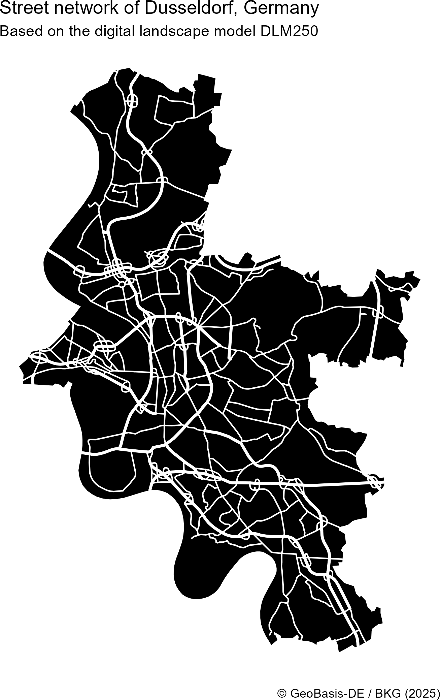

# ffm

[ffm](https://github.com/jslth/ffm/) is an R package that provides quick
and easy access to data from the geodata center of Germany’s Federal
Agency for Cartography and Geodesy (BKG). The BKG is the official
provider of spatial data in Germany and provides quite a few datasets as
open data. These data range from administrative areas to earth
observation data and are often crucial when working with regional
statistics from Germany. Part of the motivation for this package stems
from frustration when working areal identifiers returned by packages
like `{wiesbaden}` or [restatis](https://correlaid.github.io/restatis/)
and not being able to quickly link them to their spatial
representations.

The name `ffm` is based on the colloquial short name of Frankfurt am
Main where the BKG’s headquarters are located.

## Gallery

The following examples were created using
[ffm](https://github.com/jslth/ffm/). You can see their code in the
`examples/` directory.

|                                         |                                         |
|-----------------------------------------|-----------------------------------------|
|  |  |
|     |   |

## Installation

You can install the development version of ffm from
[GitHub](https://github.com/) with:

``` r
# install.packages("pak")
pak::pak("jslth/ffm")
```

## Example

Retrieving data is pretty straightforward:

``` r
library(ffm)
districts <- bkg_admin(level = "krs", scale = "5000")
```

Code for the plot

``` r
library(ggplot2)

ggplot(districts) +
  geom_sf(fill = NA) +
  theme_void()
```


The package makes it easy to go deeper than just getting the data. In
many functions, you can use spatial filters.

``` r
districts <- bkg_admin(
  level = "krs",
  scale = "5000",
  bbox = c(xmin = 700000, ymin = 5900000, xmax = 850000, ymax = 6000000),
  predicate = "intersects"
)
districts$label <- ifelse(
  districts$bez == "Kreisfreie Stadt",
  paste("Stadt", districts$gen),
  districts$gen
)
```

Code for the plot

``` r
library(ggrepel)

ggplot(districts) +
  geom_sf(fill = NA) +
  geom_text_repel(
    aes(label = label, geometry = geometry),
    stat = "sf_coordinates",
    size = 3
  ) +
  theme_void()
```


Attribute filters are supported using an R-like syntax.

``` r
munics <- bkg_admin(
  level = "gem",
  key_date = "1231",
  sn_l %in% c("08", "09")
)
```

Code for the plot

``` r
munics$popdens <- munics$ewz / munics$kfl
munics$popdens[munics$popdens == 0] <- NA
ggplot(munics) +
  geom_sf(aes(fill = popdens), color = NA) +
  scale_fill_viridis_b("Population / km²", transform = "log10") +
  ggtitle("Population density in Southern Germany") +
  theme_void()
```


# Supported products

| Function              | Description                                                                                                                                                  | BKG products                                                                                                      |
|:----------------------|:-------------------------------------------------------------------------------------------------------------------------------------------------------------|:------------------------------------------------------------------------------------------------------------------|
| `bkg_admin`           | Administrative boundaries at different spatial scales; includes country, state, government region, district, administrative associations, and municipalities | [`vg250`](https://sgx.geodatenzentrum.de/web_public/gdz/dokumentation/deu/vg250.pdf) and related products         |
| `bkg_admin_hierarchy` | Administrative boundaries containing details on their relationship to administrative areas of higher levels in the territorial hierarchy                     | [`vz250`](https://sg.geodatenzentrum.de/web_public/gdz/dokumentation/deu/vz250.pdf)                               |
| `bkg_admin_highres`   | Administrative boundaries at a significantly lower resolution that provided by [`bkg_admin()`](https://jslth.github.io/ffm/reference/bkg_admin.md)           | [`vg25`](https://sgx.geodatenzentrum.de/web_public/gdz/dokumentation/deu/vg25.pdf)                                |
| `bkg_ags`             | Geographical names associated with official keys (AGS and ARS)                                                                                               | [`wfs_gnde`](https://sgx.geodatenzentrum.de/web_public/gdz/dokumentation/deu/wfs-gnde.pdf)                        |
| `bkg_airports`        | International, regional, and special airports in Germany                                                                                                     | [`wfs_poi_open`](https://sgx.geodatenzentrum.de/web_public/gdz/dokumentation/deu/poi-open.pdf)                    |
| `bkg_amr`             | Labor market regions (Arbeitsmarktregionen)                                                                                                                  | [`ge250`](https://sgx.geodatenzentrum.de/web_public/gdz/dokumentation/deu/ge250.pdf) and related products         |
| `bkg_area_codes`      | Area code regions (Vorwahlgebiete)                                                                                                                           | [`wfs_gnde`](https://sgx.geodatenzentrum.de/web_public/gdz/dokumentation/deu/wfs-gnde.pdf)                        |
| `bkg_ars`             | Geographical names associated with official keys (AGS and ARS)                                                                                               | [`wfs_gnde`](https://sgx.geodatenzentrum.de/web_public/gdz/dokumentation/deu/wfs-gnde.pdf)                        |
| `bkg_authorities`     | Regions of administrative responsibility for several agencies (Behördenzuständigkeitsbereiche)                                                               | [`wfs_bzb_open`](https://sgx.geodatenzentrum.de/web_public/gdz/dokumentation/deu/bzb-open.pdf)                    |
| `bkg_bkr`             | Lignite extraction regions (Braunkohlereviere)                                                                                                               | [`ge250`](https://sgx.geodatenzentrum.de/web_public/gdz/dokumentation/deu/ge250.pdf) and related products         |
| `bkg_clc`             | Land cover areas based on the Corine Land Cover (CLC) nomenclature                                                                                           | [`wfs_clc5`](https://sgx.geodatenzentrum.de/web_public/gdz/dokumentation/deu/clc5_2018.pdf)                       |
| `bkg_crossings`       | International border crossings                                                                                                                               | [`wfs_poi_open`](https://sgx.geodatenzentrum.de/web_public/gdz/dokumentation/deu/poi-open.pdf)                    |
| `bkg_dem`             | Elevation raster from the digital elevation model (DEM)                                                                                                      | [`dgm200`](https://sgx.geodatenzentrum.de/web_public/gdz/dokumentation/deu/dgm200.pdf)                            |
| `bkg_dlm`             | Topographical objects of a landscape from the Digital Landscape Model (DLM)                                                                                  | [`dlm250`](https://sgx.geodatenzentrum.de/web_public/gdz/dokumentation/deu/dlm250.pdf) and related products       |
| `bkg_endonyms`        | Geographic names as endonyms                                                                                                                                 | [`wfs_gnde`](https://sgx.geodatenzentrum.de/web_public/gdz/dokumentation/deu/wfs-gnde.pdf)                        |
| `bkg_geonames`        | Geographic name metadata based on National Name Identifiers (NNID)                                                                                           | [`wfs_gnde`](https://sgx.geodatenzentrum.de/web_public/gdz/dokumentation/deu/wfs-gnde.pdf)                        |
| `bkg_ggr`             | City regions (Großstadtregionen)                                                                                                                             | [`ge250`](https://sgx.geodatenzentrum.de/web_public/gdz/dokumentation/deu/ge250.pdf) and related products         |
| `bkg_grid_full`       | INSPIRE-compliant grid geometries (GeoGitter)                                                                                                                | [`GeoGitter`](https://sgx.geodatenzentrum.de/web_public/gdz/dokumentation/deu/geogitter.pdf)                      |
| `bkg_heliports`       | Heliports                                                                                                                                                    | [`wfs_poi_open`](https://sgx.geodatenzentrum.de/web_public/gdz/dokumentation/deu/poi-open.pdf)                    |
| `bkg_kfz`             | Vehicle registration plate regions (KFZ-Kennzeichen)                                                                                                         | [`kfz250`](https://sgx.geodatenzentrum.de/web_public/gdz/dokumentation/deu/kfz250.pdf)                            |
| `bkg_kilometrage`     | Kilometrages of German federal motorways                                                                                                                     | [`wfs_poi_open`](https://sgx.geodatenzentrum.de/web_public/gdz/dokumentation/deu/poi-open.pdf)                    |
| `bkg_kmr`             | Metropolitan regions (Metropolregionen)                                                                                                                      | [`ge250`](https://sgx.geodatenzentrum.de/web_public/gdz/dokumentation/deu/ge250.pdf) and related products         |
| `bkg_krg`             | District regions (Kreisregionen)                                                                                                                             | [`ge250`](https://sgx.geodatenzentrum.de/web_public/gdz/dokumentation/deu/ge250.pdf) and related products         |
| `bkg_mbe`             | BBSR Mittelbereiche                                                                                                                                          | [`ge250`](https://sgx.geodatenzentrum.de/web_public/gdz/dokumentation/deu/ge250.pdf) and related products         |
| `bkg_mkro`            | Conurbations (Verdichtungsräume)                                                                                                                             | [`ge250`](https://sgx.geodatenzentrum.de/web_public/gdz/dokumentation/deu/ge250.pdf) and related products         |
| `bkg_nuts`            | NUTS regions of scale 1 to 3 from the EU territorial division                                                                                                | [`bkg_nuts250`](https://sgx.geodatenzentrum.de/web_public/gdz/dokumentation/deu/nuts250.pdf) and related products |
| `bkg_quasigeoid`      | German Combined Quasigeoid, the official height reference surface of the German land survey                                                                  | [`quasigeoid`](https://sgx.geodatenzentrum.de/web_public/gdz/dokumentation/deu/quasigeoid.pdf)                    |
| `bkg_rg`              | Travel areas (Reisegebiete)                                                                                                                                  | [`ge250`](https://sgx.geodatenzentrum.de/web_public/gdz/dokumentation/deu/ge250.pdf) and related products         |
| `bkg_ror`             | Spatial planning regions (Raumordnungsregionen)                                                                                                              | [`ge250`](https://sgx.geodatenzentrum.de/web_public/gdz/dokumentation/deu/ge250.pdf) and related products         |
| `bkg_seaports`        | Seaports to the North and Baltic Sea                                                                                                                         | [`wfs_poi_open`](https://sgx.geodatenzentrum.de/web_public/gdz/dokumentation/deu/poi-open.pdf)                    |
| `bkg_stations`        | Public transport stations and stops                                                                                                                          | [`wfs_poi_open`](https://sgx.geodatenzentrum.de/web_public/gdz/dokumentation/deu/poi-open.pdf)                    |
| `bkg_trauma_centers`  | Trauma centers                                                                                                                                               | [`wfs_poi_open`](https://sgx.geodatenzentrum.de/web_public/gdz/dokumentation/deu/poi-open.pdf)                    |

# Related packages

- [`{giscoR}`](https://ropengov.github.io/giscoR/) for retrieving EU
  geodata (also including Germany)
- [`{bonn}`](https://doi.org/10.32614/CRAN.package.bonn) for retrieving
  German areal indicators with official identifiers
- [`{restatis}`](https://doi.org/10.32614/CRAN.package.restatis) and
  [`{wiesbaden}`](https://doi.org/10.32614/CRAN.package.wiesbaden) for
  retrieving regional statistics from Germany
- [`{z22}`](https://doi.org/10.32614/CRAN.package.z22) for retrieving
  gridded German census data
- [`{rdwd}`](https://doi.org/10.32614/CRAN.package.rdwd) for retrieving
  German weather and climate data

# Copyright notice

> BKG geodata is provided free of charge but remains copyrighted and
> subject to BKG licensing. They are licensed under the German Open Data
> license [dl-de/by-2-0](https://www.govdata.de/dl-de/by-2-0) and can be
> used both commercially and non-commercially with attribution.
>
> When incorporating BKG geodata, please include the following
> attribution. Update the year to match your data acquisition data and
> keep the links intact.
>
> - If data modified: © [BKG](https://www.bkg.bund.de/) (date of last
>   access) [dl-de/by-2-0](https://www.govdata.de/dl-de/by-2-0) (data
>   edited)
> - If not modified: © [BKG](https://www.bkg.bund.de/) (date of last
>   access) [dl-de/by-2-0](https://www.govdata.de/dl-de/by-2-0)

This is a summary based on the BKG [copyright
notice](https://gdz.bkg.bund.de/index.php/default/hinweise-zu-nutzungsbedingungen-und-quellenvermerken/)

# Disclaimer

This package is an independent project and is not affiliated with,
endorsed by, or officially connected to the Federal Agency for
Cartography and Geodesy (Bundesamt für Kartographie und Geodäsie, BKG)
in any way. All references to data, services, or resources provided by
the BKG are for informational purposes only.
